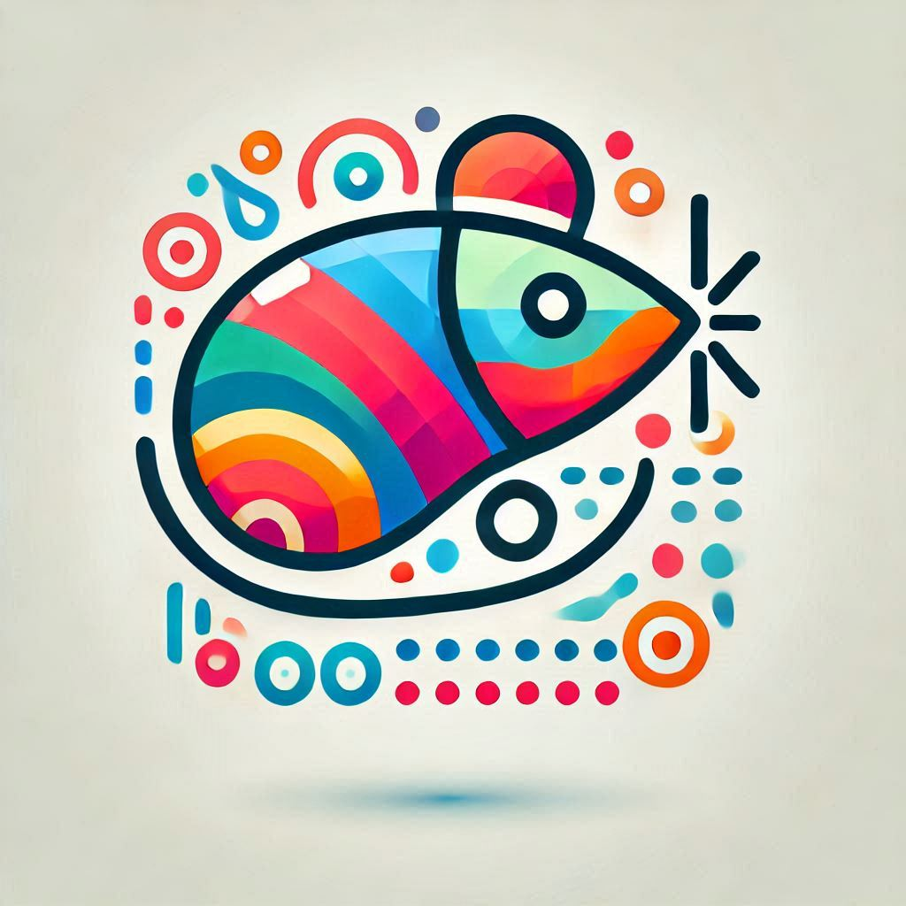

# MouseTracks

MouseTracks is an application designed to track and visualize mouse movements, clicks, keyboard activity, and gamepad inputs over time. It's designed to be unobtrusive, allowing you to leave it running indefinitely - even for years - and return later to render high-quality, colorful visualisations of the data.

## Features

- ### Live Tracking:
  Continuously monitors mouse movements and clicks, with older movements gradually fading out to maintain a clear view of recent activity.

  Keyboard heatmaps and gamepad inputs are also supported.

- ### Live Preview
  The GUI includes a real-time preview of tracking data, combining thumbnail renders with live input.

- ### High-Quality Rendering:
  Renders are generated at full quality, regardless of resolution changes. Each input type is tracked independently and merged during the render process.

  - Mouse and gamepad thumbsticks: Track maps and position heatmaps.

  - Mouse clicks: Heatmaps.

  - Key presses: Heatmap overlaid on a keyboard image.

  - _(Gamepad button rendering is not yet supported.)_

- ### Colourful Customisation:
  Includes predefined and customizable color maps for all render types.

- ### Application Tracking:
  Use separate tracking profiles when different applications (as defined in `AppList.txt`) are detected.

  _(Manual updates required for new applications.)_

- ### Multi-Monitor Support:
  Tracks activity across multiple monitors. If linked to a specific application, the rendering bounds will automatically adjust to the application's window geometry.

- ### Unobtrusive:
  Designed to run silently in the background. Closing the GUI will minimise it to the System Tray.

- ### Modular Design:
  The application was designed with multiple components that communicate but run independenantly of each other, ensuring the live tracking remains fully stable, even during resource-intensive tasks like rendering or waiting on GUI operations.

---

## Installation (v2.0)

_Currently, only Windows is supported. Contributions for Linux or macOS support are welcome!_

### Prebuilt Executable

Launch `MouseTracks.exe` from anywhere. Recommended for ease of use.

Build it using [`build.bat`](build.bat), or download it from the releases (available with v2.0).

### Virtual Environment

Recommended if running the code locally.

1. Run `python -m venv .venv` to create the virtual environment with Python 3.11 or above.
2. Run `launch.bat`.

### Without a Virtual Environment

Run `launch.py`.

Ensure all modules in [requirements.txt](requirements.txt) are installed.

---

## Installation (v1.0 - Deprecated)

_The 1.0 version is no longer supported. However it may receive minor updates to the launch process to bring it in line with v2.0._

- `start_tracking.py`: Run this to start recording data.
- `generate_images.py`: Script for rendering visualisations from the saved data.

### Requirements for v1.0
- #### Core Modules:
  Python 2.7+, [Numpy](https://pypi.python.org/pypi/numpy), [psutil](https://pypi.python.org/pypi/psutil), [scipy](https://pypi.python.org/pypi/scipy), [Pillow](https://pypi.python.org/pypi/Pillow), [Flask](http://flask.pocoo.org/) ([optional](# "Used for the API")), [PyCrypto](https://pypi.python.org/pypi/pycrypto) ([optional](# "Used to encrypt API messages")), [pyglet](https://pypi.python.org/pypi/pyglet/1.3.0) (included)

- #### Windows Extras:
  [pywin32](https://sourceforge.net/projects/pywin32/files/pywin32) ([optional](# "Used for the tray icon")), [xinput](https://github.com/r4dian/Xbox-360-Controller-for-Python/blob/master/xinput.py) (included)

- ##### Linux Extras (WIP):
  [xlib](https://pypi.python.org/pypi/python-xlib), [pyxhook](https://pypi.org/project/pyxhook/)

- ##### Mac Extras (WIP):
  [AppKit](https://pypi.python.org/pypi/AppKit/0.2.8)

---

## Example Output

### Colour Maps
#### Chalk

#### Citrus

#### Demon

#### Sunburst

#### Ice

#### Hazard

#### Spiderman

#### Graffiti

#### Lightning

#### Razer

#### BlackWidow

#### Grape

#### Neon

#### Shroud

## Game Genres
#### Twin Stick

#### FPS

#### RTS

#### MOBA

## Icon
I didn't have any plan of what it might look like, so I gave a vague prompt to Copilot to see what would happen.

> Can you generate me an icon for my mousetracks app? It records clicks, cursor movement, keyboard presses, gamepad data, etc.

This was the first result, my partner loved it and I think it captures the essence of the application really well.
