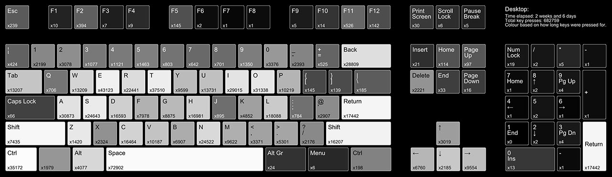
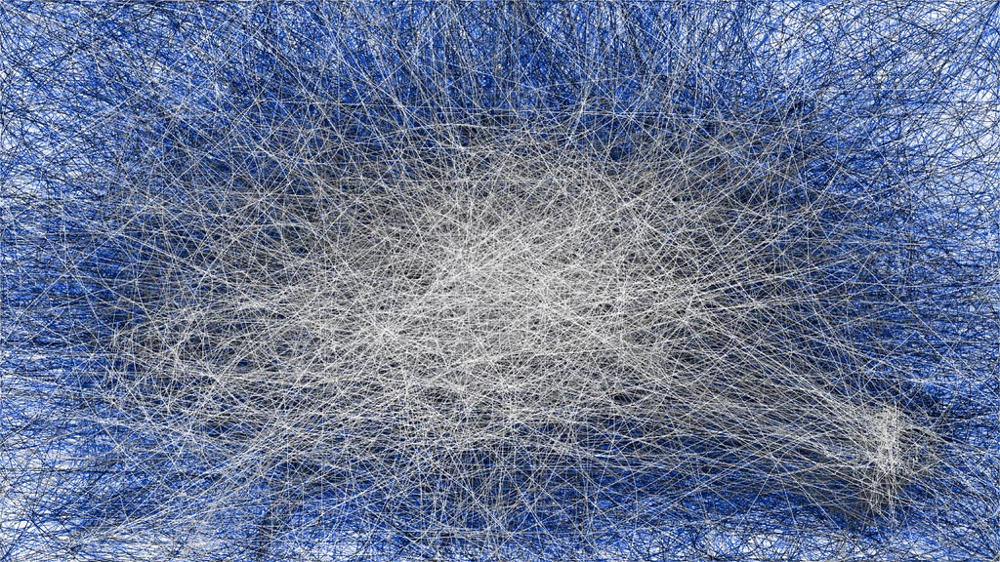
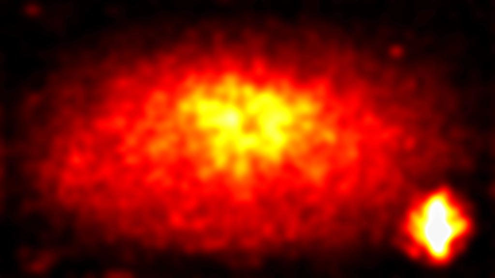

# MouseTracks

MouseTracks is an application designed to track and visualize mouse movements, clicks, keyboard activity, and gamepad inputs over time. It's designed to be unobtrusive, allowing you to leave it running indefinitely - even for years - and return later to render colourful visualisations of the data.

## Features

- ### Live Tracking
  Continuously monitors mouse movements and clicks. Older movements gracefully fade, keeping the view focused on recent activity.

  Keyboard heatmaps and gamepad inputs are also supported.

- ### Live Preview
  The GUI displays an optimised real-time render of tracking data.

- ### Image Rendering
  Renders are generated at full quality, regardless of resolution changes. Each resolution is tracked independently and merged during the render process.

  - Mouse and gamepad thumbsticks: Track maps and position heatmaps.

  - Mouse clicks: Heatmaps.

  - Key presses: Heatmap overlaid on a keyboard image.

  - _(Gamepad rendering is not yet supported.)_

- ### Colourful Renders
  Includes predefined colour maps for all render types, with the option to customise or create your own.

- ### Application Tracking
  Use separate tracking profiles depending on which application has focus.

  _(New applications must be added via the GUI.)_

- ### Multi-Monitor Support
  Tracks activity across multiple monitors. If linked to a specific application, the rendering bounds will automatically adjust to the application's window geometry.

- ### Unobtrusive
  Designed to run silently in the background. It can be configured to launch on startup and minimise directly to the System Tray.

- ### Modular Design
  The application was designed with multiple components that communicate but run independently of each other, ensuring the live tracking remains fully stable, even during resource intensive tasks like rendering or waiting on GUI operations.

- ### Stability
  A lot of effort has been put into making this as error free as possible, so it will happily keep running for years without any issues.

MouseTracks is and will always remain free, but if you enjoy using it and would like to [buy me a pint](https://ko-fi.com/huntfx) in appreciation (as I don't like coffee), then that would be very kind.

Questions? Check out the [FAQ](https://github.com/huntfx/MouseTracks/wiki#faq), or [raise an issue](https://github.com/huntfx/MouseTracks/issues) if you can't find an answer.

---

## Installation (v2.0)

_Currently, only Windows is supported. Contributions for Linux or macOS support are welcome._

### Prebuilt Executable

Launch `MouseTracks.exe` from anywhere. Recommended for ease of use.

Download it from the [latest release](https://github.com/huntfx/MouseTracks/releases/latest), or build it yourself using [`build-pyinstaller.bat`](build-pyinstaller.bat)

It's also possible to run [`build-nuitka.bat`](build-nuitka.bat), but this is not recommended unless you have a commercial license, as it will be flagged by a lot of AV programs.

### Virtual Environment

Recommended if running the code locally.

1. Run `python -m venv .venv` to create the virtual environment with Python 3.11 or above.
2. Run `launch.bat`.

### Without a Virtual Environment

Run `launch.py`.

Ensure all modules in [requirements.txt](requirements.txt) are installed.

---

## Installation (v1.0 - Deprecated)

_The v1.0 version is no longer supported, but the launch process has been updated to bring it in line with v2.0._

You will be prompted with a choice to start tracking or generate images. This can be skipped by passing the `--start-tracking` or `--generate-images` flags.

### Virtual Environment

Recommended if running the code locally.

1. Run `python -m venv .venv-legacy` to create the virtual environment with any version of Python.
2. Run `launch-legacy.bat`.

### Without a Virtual Environment

Run `launch-legacy.py`.

Ensure all modules in [requirements-legacy.txt](requirements-legacy.txt) are installed.

---

## Render Types
Multiple data types can be rendered. 
There are additional options, but the main ones are highlighted below.

The majority of these renders are from 500 hours of general PC use, excluding coding and gaming. 
The gamepad renders are from a game that was played for 30 hours.

### Mouse Movement

### Mouse Speed

### Mouse Position

### Mouse Clicks

## Keyboard Heatmap

### Gamepad Thumbstick Movement

### Gamepad Thumbstick Position

## Colour Maps
Each render is given a colour map. 
There are additional options, but the main ones are highlighted below. 
It's also possible to [define your own](https://github.com/huntfx/MouseTracks/wiki/Colour-Maps).

### Ice

### Citrus

### Demon

### Sunburst

### Jet

### Explosion

### Submerged

### Aqua

### Nature

### Fire

### Chalk

## Render Examples
#### Desktop

## Path of Exile

#### Factorio

#### Overwatch

#### Torchlight 2

#### Heroes of the Storm

#### Hogwarts Legacy

#### Livelock

#### Alien Swarm

#### Age of Empires IV

#### Adobe Lightroom

## Data Privacy
All data recorded or generated by MouseTracks is stored entirely locally on your computer. You have full control over this data, including the ability to change the storage location, export your data, and delete it.

MouseTracks does not transmit any of your personal data or usage information over the internet - the only connection made is to check for updates, and this feature can be completely disabled with the `--offline` flag if required.
